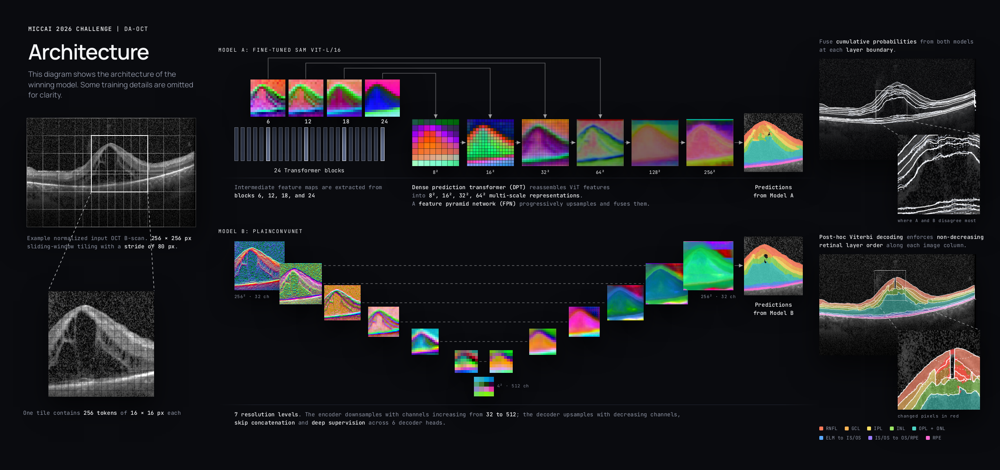

# OCT layer segmentation under domain shift

This repository contains the code and recipes for the winning entry in the MICCAI 2026 Domain Adaptation for OCT (DA-OCT) challenge. The submission predicts ten ordered retinal classes (nine interfaces) on scans from unseen OCT vendors.

The five official validation-phase scores were 0.6935, 0.7379, 0.7455, 0.8197, and 0.8263. The Final submission scored **0.8068** (macula **0.84**, widefield **0.78**) and placed first. Validation and Final scores refer to different phases of the challenge.



*Example B-scan: Kermany et al., “Labeled Optical Coherence Tomography (OCT) and Chest X-Ray Images for Classification,” Mendeley Data v3, CC BY 4.0. The illustration uses a public OCT2017 test image processed with the final weights.*

## Method

The submission combines two models: 
- Model A uses a SAM ViT-L/16 encoder with a DPT/FPN decoder
- Model B is a seven-stage PlainConvUNet trained from scratch. 

Both predict the official ten-class label space. Partial labels are represented as intervals, and co-teaching uses each model’s EMA teacher to provide gated pseudo-labels to its peer. Inference runs at native image resolution, combines boundary probabilities from both models, and extracts nine retinal interfaces while preserving their anatomical order.

The recipes select fixed epochs rather than local validation rulers. See [METHOD](docs/METHOD.md) for the training stages and [REPRODUCE](docs/REPRODUCE.md) for the supported workflow.

# Start here

Use Python 3.11. Install the recorded dependencies, then fill in one private machine configuration:

```bash
python -m venv .venv
. .venv/bin/activate
pip install --extra-index-url https://download.pytorch.org/whl/cu128 -r requirements.txt
cp configs/local.example.yaml configs/local.yaml
```

Configuration options are documented in [configs/README.md](configs/README.md):
- `reproduction/model_a/` and `reproduction/model_b/` reproduce the training recipes for the submitted models.
- `framework/` provides configurations for training a standalone model.

Edit `configs/local.yaml` to set the paths for your machine:
- `scratch`: a writable directory for intermediate files and training outputs.
- `data`: the root directory containing your downloaded datasets.
- `published_weights`: the directory containing `model.pt` and `model_b.pt`, if using the published weights.

See [DATA](docs/DATA.md) for download instructions and the expected directory structure.

The following commands support environment checks, full reproduction, and standalone training:

| Task | Command | Description |
| --- | --- | --- |
| Check reproduction readiness | `python scripts/repro.py check all` | Checks the environment, input files, data pools, and weights against the recorded reference and reports any differences. |
| Reproduce the submission’s training pipeline | `python scripts/repro.py reproduce --local` | Checks readiness, builds data pools, runs the training stages in sequence, and exports both models. |
| Train a standalone model | `python scripts/repro.py run --config configs/framework/cnn.yaml --local` | Trains a model using the specified configuration. |

Add `--dry` to `reproduce` or `run` to preview the commands without executing them. Omit `--local` to submit jobs through Slurm using your configured settings. Full reproduction requires substantial compute and is optional when using published weights or training with a custom configuration.

> [!NOTE]
> An exact match to the reference setup is not required to run the pipeline. Differences in package versions, GPU type, dataset counts, or checkpoint hashes are reported for reference and do not block execution. Missing required files, invalid configurations, and computation failures will still stop the affected operation.

## How to use the trained models

Place `model.pt` and `model_b.pt` in the directory specified by `published_weights`, then run inference:

```bash
python scripts/repro.py infer --images /path/to/images --out /path/to/masks --weights published --local
```

To check the inference and scoring pipeline, run:

```bash
python scripts/repro.py score --weights published --local
```

The `score` command runs the locally downloaded official scorer on the synthetic data released by the organizers. It reports the measured score and its difference from the reference score.

> [!NOTE]
> The score command uses the official scorer and released synthetic data to verify that the inference and scoring pipeline reproduces the reference result. Most of these images were used in training, so this is a reproducibility check rather than an evaluation on held-out data.

To run inference directly with a single checkpoint:

```bash
python -m octtta.infer --input /path/to/images --output /path/to/masks \
  --checkpoint /path/to/checkpoint.pt --no-degrade
```

Additional options:
- Add `--checkpoint-b /path/to/model_b.pt` to combine predictions from two models.
- Add `--device cpu` to run inference on the CPU.

See [REPRODUCE](docs/REPRODUCE.md) for a complete walkthrough, including custom training and model export.

## Model availability

Model weights are not yet publicly available. Download links and instructions will be added in a future release.

# Intended use and limitations

These models are intended for research on retinal OCT segmentation under domain shift and have not been validated for clinical use. Challenge results may not generalize to other scanners, populations, or imaging workflows.

Training datasets and label mappings are documented in [DATA](docs/DATA.md). Retraining may produce different weights and results due to variation in hardware, software, and random initialization.

# Official resources

The challenge concluded on September 14, 2026. The organizers’ resources are retained here for reference:

- [Starting kit](https://qtim-challenges.southcentralus.cloudapp.azure.com/datasets/download/799fb349-7c92-4e0d-b05a-30e9d441f49a/)
- [Baseline repository](https://github.com/wusmai/miccai-challenge-daoct-baseline)
- [Docker setup instructions](https://github.com/wusmai/miccai-challenge-daoct-baseline#docker-setup)

These resources document the competition workflow and submission requirements used during the challenge. For dataset access instructions, see [DATA](docs/DATA.md).

The architecture figure uses a public OCT2017 image, as credited in its caption. [METHOD](docs/METHOD.md) also includes an AI-READI boundary illustration.

# Authors

Yang Zhang, Rong Zhou, Younjoon Chung, and Qingyu Chen (Corresponding Author)  
Yale University

**Contact**: [yang.zhang.yz2483@yale.edu](mailto:yang.zhang.yz2483@yale.edu)

See the [Yale announcement](https://medicine.yale.edu/news-article/yale-bids-team-wins-da-oct-challenge/) for details of the challenge result.

# License and acknowledgments

The source code and model weights are released under the BSD 2-Clause license. See [LICENSE](LICENSE) for the license text. Third-party components remain subject to their respective licenses.

The organizers’ starting kit and scoring program must be downloaded separately. Reference file hashes are recorded in `configs/expected.json`.

Data used in this work were obtained from the [AI-READI Flagship Dataset of Type 2 Diabetes (v3.0.0)](https://doi.org/10.60775/fairhub.3), licensed by Washington University in St. Louis under the AI-READI Data License Agreement v2.0. The AI-READI project is supported by NIH grant 1OT2OD032644 through the NIH Bridge2AI Common Fund program.

Please cite both the [AI-READI Consortium publication in *Nature Metabolism* (2024)](https://doi.org/10.1038/s42255-024-01165-x) and the [dataset DOI](https://doi.org/10.60775/fairhub.3) when using these data.


# Citation

The manuscript describing this work is in preparation. Citation details will be added once it is publicly available.