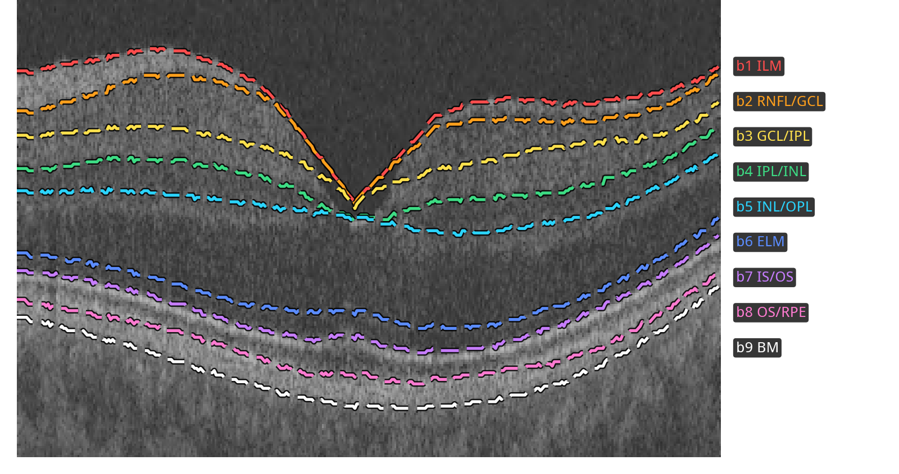

# Method

The historical Final DA-OCT entry combines a SAM encoder and a convolutional segmenter. This release provides local training, export and native-resolution inference. Historical recipes are under `configs/reproduction/`; custom single-model training is under `configs/framework/`. Competition-time adaptation and submission packaging remain in the preserved original submission artifact, outside this framework.

## Task and labels

A B-scan is segmented into ten ordered classes separated by nine retinal interfaces:

*Topcon Maestro2 example from AI-READI v3, with device-provided boundary curves. See the dataset acknowledgement in the [README](../README.md#licence-and-acknowledgement).*

The [label-mapping table in DATA](DATA.md#label-mapping) describes how each source is converted to this convention. Missing interfaces are trained with interval labels.

## Networks

| Model | Encoder | Decoder |
|---|---|---|
| A | SAM ViT-L/16, one input channel, taps after blocks 6, 12, 18 and 24 | DPT reassembly, additive FPN, six deep-supervision heads |
| B | Seven convolutional stages, channels 32/64/128/256/512/512/512 | PlainConvUNet with concatenated skips and six deep-supervision heads |

The SAM neck is removed. Windowed attention uses a 16-token window, matching the token grid of a 256-pixel training tile, while the pretrained absolute positional embedding is resampled for the input grid. Model B starts from random initialization and uses affine InstanceNorm without running statistics. Both return the finest head during inference. The architecture figure shows real intermediate outputs from the shipped weights on a public OCT2017 example.

## Loss and augmentation

Deep supervision combines cross-entropy, soft Dice and a height-normalized signed-distance boundary loss, with head weights halving at successive scales. Interval labels contribute interval cross-entropy; exactly labelled pixels also contribute Dice. An interval-share penalty discourages one class from taking over a broad, partially annotated band. Appearance consistency compares a clean view and a degraded view with the clean prediction detached.

Images are normalized independently, so no cohort intensity statistics are shared. Training crops are 256 by 256 pixels in the image's native coordinate system; geometric augmentation changes scale and shape during training. The augmentation pipeline composes affine transforms, elastic and column warps, and scanner-like appearance changes. The second lineage also uses synthetic optic-disc augmentation. The model-A view caps the Cirrus optic-disc cell at four frames per volume; model B uses the uncapped cell. These source-level choices do not resize native-resolution inference images.

## Training and fixed epochs

Each lineage has SAM phase 1, SAM phase 2, CNN training, and co-teaching. Phase 2 starts from phase 1's `last.pt`. Co-teaching starts from the lineage's phase-2 and CNN `last.pt` checkpoints. AdamW, the learning-rate schedule, augmentation and seed are recorded in the resolved recipe. The released local workflow builds the historical splits but performs no local validation or ruler-based checkpoint selection.

| Stage | Nominal epochs | Selected zero-based epoch |
|---|---:|---:|
| SAM phase 1 | 3 | 2 |
| SAM phase 2 | 15 | 14 |
| Model A CNN | 30 | 24 (`stop_epoch: 25`) |
| Model B CNN | 30 | 29 |
| Co-teaching | 1 | 0 |

`stop_epoch` bounds the training loop, while the CNN schedule retains its nominal 30-epoch length. Export takes model A and model B from their respective co-teaching checkpoints. Both lineages and all eight runs are needed to rebuild this historical pair; they are optional for custom training or inference with existing weights.

During local co-teaching, each student's EMA teacher supplies confidence- and agreement-gated boundary targets to its peer. The unlabelled AI-READI pool described in [DATA](DATA.md) is traversed once apart from the declared incomplete final batch. This local run excludes the challenge's unlabelled release images. Run-specific counts, warm starts and terminal steps are compared with `configs/expected.json` as reproduction advice.

## Inference and scoring scope

Each image is normalized as a whole, blank edge columns are trimmed, and overlapping 256-pixel tiles are inferred and Gaussian-blended back to native resolution. Shape rules choose the A/B fusion weight. Fusion operates on cumulative class probabilities, allowing interfaces to be combined consistently. A presence gate suppresses small, uncertain classes; column-wise Viterbi decoding enforces non-decreasing labels; absent classes are not introduced. Trimmed columns are restored as class 0.

The optional timed degradation ladder can reduce inference work when a time budget is set. Use `--no-degrade` for an unrestricted local dual-model check, including slow CPU inference. Architecture, normalization, post-processing and the fusion table are reconstructed from the checkpoint; no separate inference recipe is required.

The `repro.py score` command evaluates the official 230-image synthetic release with the locally downloaded official scorer. Most of those images were used in training, with run-specific held-out sets of 44 or 46 images. This is a pipeline self-check, not a held-out performance estimate. Newly trained weights are not promised to be byte-identical to the published pair.
